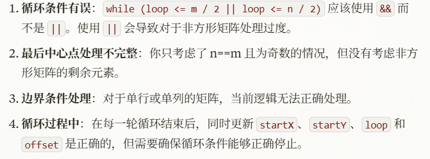

# 59. 螺旋矩阵 II

## 题目特征

- 螺旋转动遍历矩阵

## 题目解法

坚持循环不变量原则。

这里坚持了每条边左闭右开的原则

模拟顺时针画矩阵的过程:

1. 填充上行从左到右
2. 填充右列从上到下
3. 填充下行从右到左
4. 填充左列从下到上

由外向内一圈一圈这么画下去。

时间复杂度 $O(n^2)$: 模拟遍历二维矩阵的时间

空间复杂度 $O(1)$

## 题目延伸

### 54. 螺旋矩阵

spiralOrder.java

这道题和主题目思想差不多，但不能直接挪用主题目的代码，否则就和我第一版的结果一样👇

改进方法（谢谢Claude）：

1. 使用了四个边界变量（left, right, top, bottom）来控制遍历范围，这样更直观且易于控制。
2. 循环条件改为 left <= right && top <= bottom，确保有效的遍历区域。
3. 在向左和向上遍历时，增加了条件检查 top <= bottom 和 left <= right，避免重复访问元素。
4. 每次完成一个方向的遍历后，立即更新对应的边界，保证下一次遍历的正确性。
5. 移除了对中心点的特殊处理，因为边界向内收缩的方式已经能正确处理所有情况，包括奇数大小的矩阵。

时间复杂度$O(M*N)$

空间复杂度$O(1)$

### To be continued...

