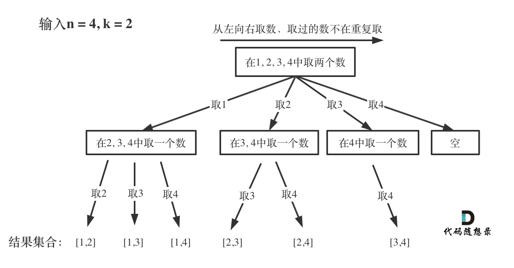
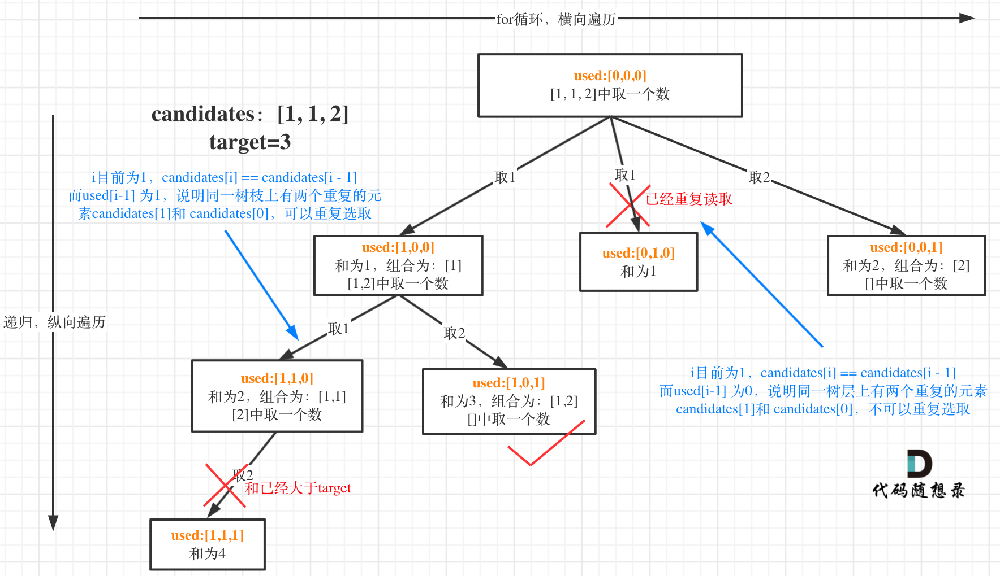
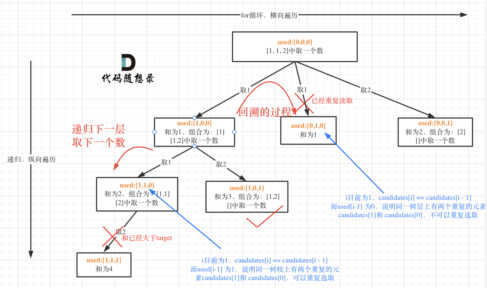
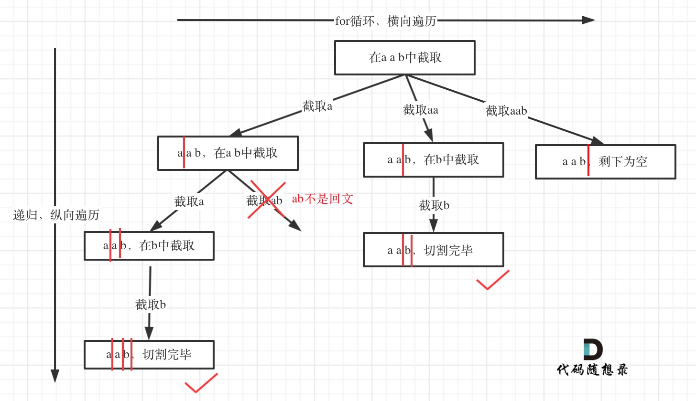
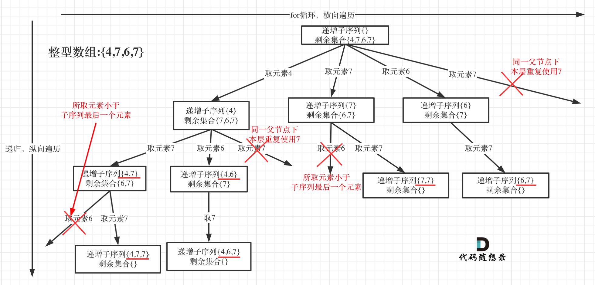
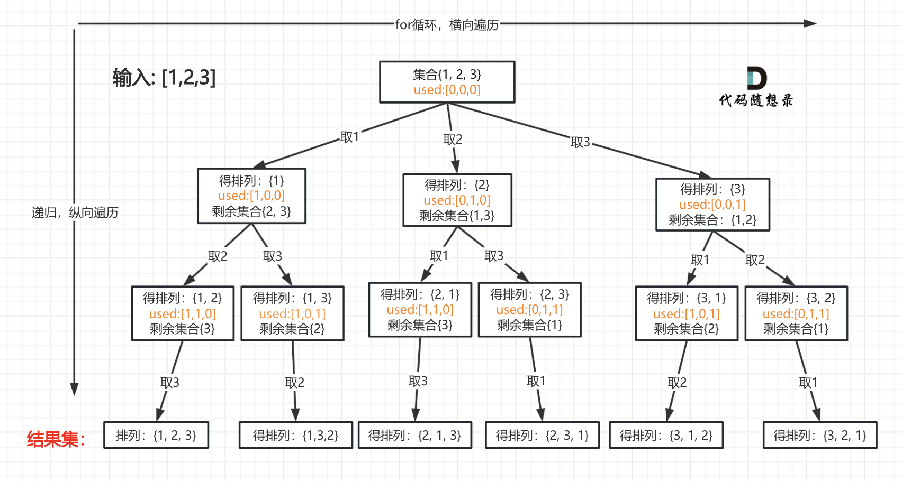
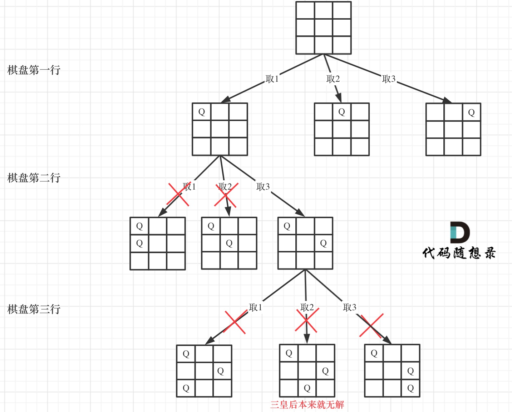
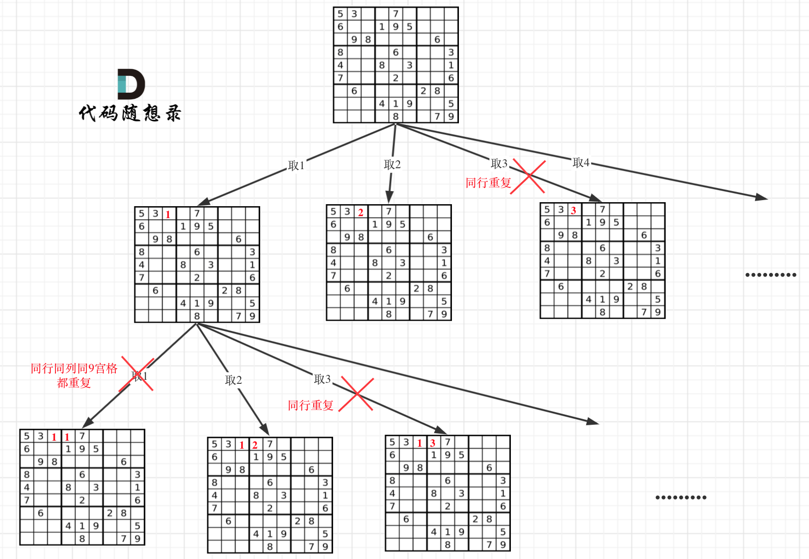

# 基础知识

回溯算法适用于以下题型：

* 组合问题：N个数里面按一定规则找出k个数的集合
* 切割问题：一个字符串按一定规则有几种切割方式
* 子集问题：一个N个数的集合里有多少符合条件的子集
* 排列问题：N个数按一定规则全排列，有几种排列方式
* 棋盘问题：N皇后，解数独等等

## 回溯算法模板

### 1. 回溯函数模板返回值以及参数

回溯算法中函数返回值一般为`void`。

因为回溯算法需要的参数可不像二叉树递归的时候那么容易一次性确定下来，所以一般是先写逻辑，然后需要什么参数，就填什么参数。

### 2. 回溯函数终止条件

一般来说搜到叶子节点了，也就找到了满足条件的一条答案，把这个答案存放起来，并结束本层递归。

伪代码：
```
if(终止条件){
    存放结果;
    return;
}
```

### 3. 回溯搜索的遍历过程


（图中特意举例集合大小和孩子的数量是相等的）

```
for (选择：本层集合中元素（树中节点孩子的数量就是集合的大小）) {
    处理节点;
    backtracking(路径，选择列表); // 递归
    回溯，撤销处理结果
}
```

for循环可以理解是横向遍历，backtracking（递归）就是纵向遍历，这样就把这棵树全遍历完了，一般来说，搜索叶子节点就是找的其中一个结果了。

# 77. 组合 (combine)

回溯算法的经典题目



可以看出，n决定了树的宽度，k决定了树的深度。

开始回溯三部曲：

1. 递归函数的返回值以及参数

在这里要定义两个全局变量，一个用来存放符合条件单一结果，一个用来存放符合条件结果的集合。

此外，还需要一个`startIndex`，用来记录本层递归的中，集合从哪里开始遍历，防止出现重复的组合。

比如，从`[1,2,3,4]`中挑选出1后，下一个要从`[2,3,4]`中进行挑选了。

2. 回溯函数终止条件

什么时候到达所谓的叶子节点了呢？

path这个数组的大小如果达到k，说明我们找到了一个子集大小为k的组合了，在图中path存的就是根节点到叶子节点的路径。

此时用result二维数组，把path保存起来，并终止本层递归。

3. 单层搜索的过程

backtracking（递归函数）通过不断调用自己一直往深处遍历，总会遇到叶子节点，遇到了叶子节点就要返回。

backtracking的下面部分就是回溯的操作了，撤销本次处理的结果。

这道题还可以优化。

如果for循环选择的起始位置之后的元素个数 已经不足 我们需要的元素个数了，那么就没有必要搜索了。

# 216.组合总和III (combinationSum3)

注意回溯的时候，sum也要减去i

# 17.电话号码的字母组合 (letterCombinations)

可以事先定义一个数组，下标 = digit，根据下标来映射。

# 39. 组合总和 (combinationSum)

本题没有数量要求，可以无限重复，但是有总和的限制，所以间接的也是有个数的限制。


注意，虽然可以重复，但返回的是组合，不是排列，所以数字不能只是顺序不同。所以每次取数的时候，还是要从这个数本身的下标开始取。

# 40.组合总和II (combinationSum2)

本题的难点在于：集合（数组candidates）有重复元素，但还不能有重复的组合。

所谓去重，其实就是**使用过的元素不能重复选取**。

都知道组合问题可以抽象为树形结构，那么“使用过”在这个树形结构上是有两个维度的，一个维度是同一树枝上使用过，一个维度是同一树层上使用过。

回看一下题目，**元素在同一个组合内是可以重复的，怎么重复都没事，但两个组合不能相同。**

所以我们**要去重的是同一树层上的“使用过”**，同一树枝上的都是一个组合里的元素，不用去重。

**强调一下，树层去重的话，需要对数组排序！**





# 131.分割回文串 (partition)

其实切割问题类似组合问题，也可以抽象为一棵树形结构。



# 93.复原IP地址 (restoreIpAddresses)

和上一道题是类似的，仍然是切割

# 78.子集 (subsets)

如果把 子集问题、组合问题、分割问题都抽象为一棵树的话，那么**组合问题和分割问题都是收集树的叶子节点，而子集问题是找树的所有节点！**

其实子集也是一种组合问题，因为它的集合是无序的，子集`{1,2}` 和 子集`{2,1}`是一样的。

# 90.子集II (subsetsWithDup)

这道题给的数组包含重复元素，所以需要用到`used`数组

# 491.递增子序列 (findSubsequences)

本题求自增子序列，是不能对原数组进行排序的，排完序的数组都是自增子序列了。

所以不能使用之前的去重逻辑！去重逻辑和之前的略有不同（主要是used的使用）。

本题给出的示例，还是一个有序数组 [4, 6, 7, 7]，这更容易误导大家按照排序的思路去做了



**同一父节点下的同层上使用过的元素就不能再使用了！**

# 46.全排列 (permute)



# 47.全排列 II (permuteUnique)

既要全序列，又要不重复。不能用排序的去重逻辑。

# 51. N 皇后 (solveNQueens)

可以看一下约束条件：

1. 不能同行
2. 不能同列
3. 不能同斜线

其实N皇后问题也可以抽象成一棵树：



定义全局变量二维数组result来记录最终结果。

参数n是棋盘的大小，然后用row来记录当前遍历到棋盘的第几层了。

# 37. 解数独 (solveSudoku)



回溯三部曲

- 递归函数以及参数

递归函数的返回值需要是`bool`类型，为什么呢？

因为解数独找到一个符合的条件（就在树的叶子节点上）立刻就返回，相当于找从根节点到叶子节点一条唯一路径，所以需要使用bool返回值。

其他题要记录的是所有符合条件的路径，所以不用返回值

- 递归终止条件

本题递归不用终止条件，解数独是要遍历整个树形结构寻找可能的叶子节点就立刻返回。

**不用终止条件会不会死循环？**

递归的下一层的棋盘一定比上一层的棋盘多一个数，等数填满了棋盘自然就终止（填满当然好了，说明找到结果了），所以不需要终止条件！

**那么有没有永远填不满的情况呢？**

这个问题在递归单层搜索逻辑里再来讲！

- 递归单层搜索逻辑

在树形图中可以看出我们需要的是一个二维的递归 （一行一列）

一个for循环遍历棋盘的行，一个for循环遍历棋盘的列，一行一列确定下来之后，递归遍历这个位置放9个数字的可能性！

```java
//「一个for循环遍历棋盘的行，一个for循环遍历棋盘的列，
        // 一行一列确定下来之后，递归遍历这个位置放9个数字的可能性！」
        for (int i = 0; i < 9; i++){ // 遍历行
            for (int j = 0; j < 9; j++){ // 遍历列
                if (board[i][j] != '.'){ // 跳过原始数字
                    continue;
                }
                for (char k = '1'; k <= '9'; k++){ // (i, j) 这个位置放k是否合适
                    if (isValidSudoku(i, j, k, board)){
                        board[i][j] = k;
                        if (solveSudokuHelper(board)){ // 如果找到合适一组立刻返回
                            return true;
                        }
                        board[i][j] = '.';
                    }
                }
                // 9个数都试完了，都不行，那么就返回false
                return false;
                // 因为如果一行一列确定下来了，这里尝试了9个数都不行，说明这个棋盘找不到解决数独问题的解！
                // 那么会直接返回， 「这也就是为什么没有终止条件也不会永远填不满棋盘而无限递归下去！」
            }
        }
        // 遍历完没有返回false，说明找到了合适棋盘位置了
        return true;
```

注意这里return false的地方，这里放return false 是有讲究的。

因为如果一行一列确定下来了，这里尝试了9个数都不行，说明这个棋盘找不到解决数独问题的解！

那么会直接返回， 这也就是为什么没有终止条件也不会永远填不满棋盘而无限递归下去！