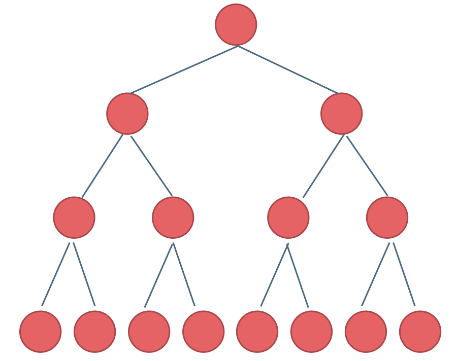
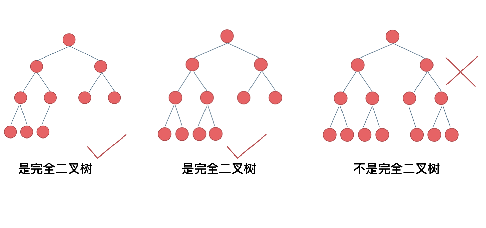
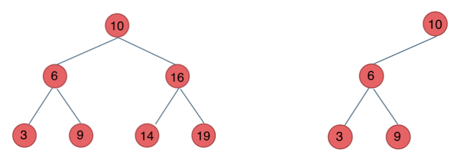
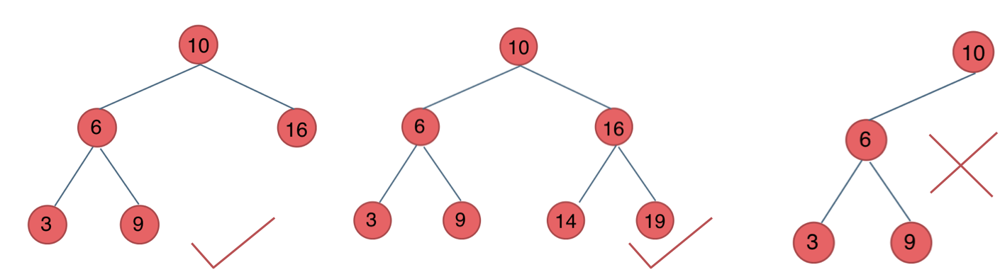
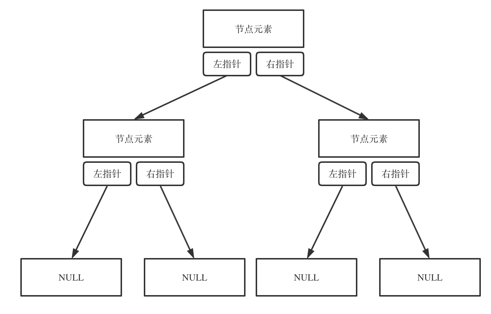
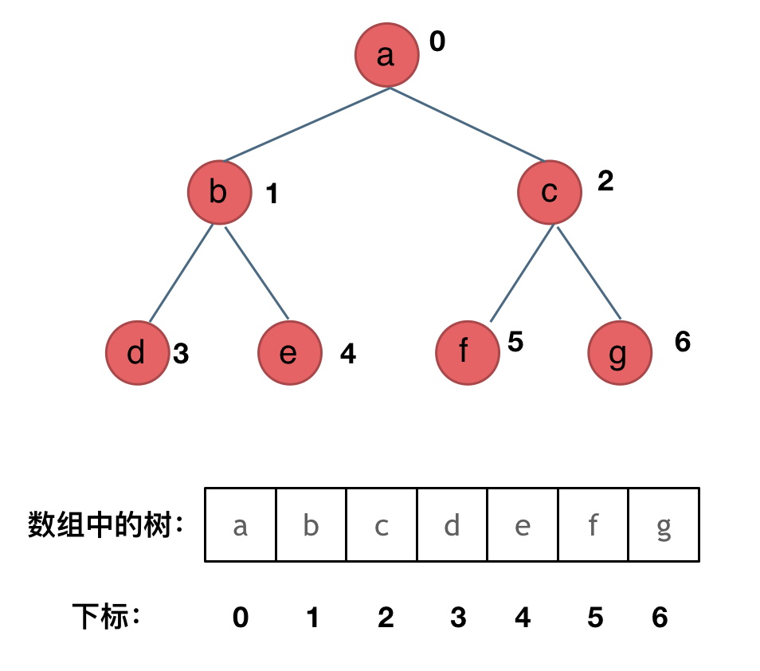
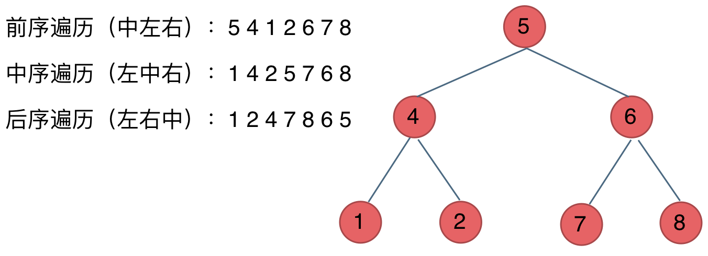
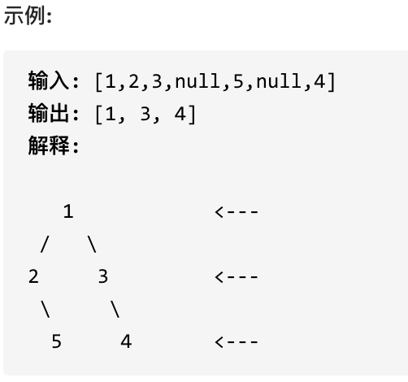

# 基础知识

## 二叉树的种类

### 满二叉树

如果一棵二叉树只有度为0的结点和度为2的结点，并且度为0的结点在同一层上，则这棵二叉树为满二叉树。



这棵二叉树为满二叉树，也可以说深度为k，有$2^{k-1}$个节点的二叉树。


### 完全二叉树

在完全二叉树中，除了最底层节点可能没填满外，其余每层节点数都达到最大值，并且最下面一层的节点都集中在该层最左边的若干位置。若最底层为第 h 层（h从1开始），则该层包含 $1$~ $2^{h-1}$ 个节点。



### 二叉搜索树

二叉搜索树是一个有序树。

- 若它的左子树不空，则左子树上所有结点的值均小于它的根结点的值；
- 若它的右子树不空，则右子树上所有结点的值均大于它的根结点的值；
- 它的左、右子树也分别为二叉排序树



### 平衡二叉搜索树

又被称为AVL（Adelson-Velsky and Landis）树，且具有以下性质：它是一棵空树或它的左右两个子树的高度差的绝对值不超过1，并且左右两个子树都是一棵平衡二叉树。



## 二叉树的存储方式

可以**链式存储**，也可以**顺序存储**。

链式存储方式就用指针， 顺序存储的方式就是用数组。

| 链式存储                 | 顺序存储                 |
|----------------------|----------------------|
| 指针                   | 数组                   |
|  |  |

其中，顺序存储中，父节点的数组下标是 i，那么它的左孩子就是 $i * 2 + 1$，右孩子就是 $i * 2 + 2$。

## 二叉树的遍历方式

**深度优先遍历**：先往深走，遇到叶子节点再往回走。

- 前序遍历（递归法，迭代法）
- 中序遍历（递归法，迭代法）
- 后序遍历（递归法，迭代法）

这里前中后，其实指的就是**中间节点**的遍历顺序



**广度优先遍历**：一层一层的去遍历。

- 层次遍历（迭代法）

## 二叉树的定义

```java

public class TreeNode{
    int val;
    TreeNode left;
    TreeNode right;
    
    TreeNode(){}
    TreeNode(int val){this.val = val;}
    TreeNode(int val, TreeNode left, TreeNode right){
        this.val = val;
        this.left = left;
        this.right = right;
    }
}
```

```python
class TreeNode:
    def __init__(self, val, left=None, right=None):
        self.val = val
        self.left = left
        self.right = right
```

# 递归遍历

递归算法的三个要素：

- 确定递归函数的参数和返回值： 确定哪些参数是递归的过程中需要处理的，那么就在递归函数里加上这个参数， 并且还要明确每次递归的返回值是什么进而确定递归函数的返回类型。

- 确定终止条件： 写完了递归算法, 运行的时候，经常会遇到栈溢出的错误，就是没写终止条件或者终止条件写的不对，操作系统也是用一个栈的结构来保存每一层递归的信息，如果递归没有终止，操作系统的内存栈必然就会溢出。

- 确定单层递归的逻辑： 确定每一层递归需要处理的信息。在这里也就会重复调用自己来实现递归的过程。

## 589.N叉树的前序遍历

思路是一样的，就是要加一个判断

```java
if(root.childen != null){
    for(Node child: root.childen){
        preorder(child,result);
    }
}

```

# 层次遍历

其实就是图论里的广度优先遍历

需要借用一个辅助数据结构即队列来实现，**队列先进先出，符合一层一层遍历的逻辑**，而用**栈先进后出适合模拟深度优先遍历也就是递归的逻辑**。


步骤：
1. 将根节点入队
2. 当队列不为空时：
   1. 处理当前层的所有节点
   2. 将下一层的所有节点入队

## 199.二叉树的右视图

层序遍历的时候，判断是否遍历到单层的最后面的元素，如果是，就放进result数组中，随后返回result就可以了。



## 637.二叉树的层平均值

本题就是层序遍历的时候把一层求个总和再取一个均值。

## 515.在每个树行中找最大值

## 116.填充每个节点的下一个右侧节点指针 & 117.

依然是层序遍历，只不过在单层遍历的时候记录一下本层的头部节点，然后在遍历的时候让前一个节点指向本节点就可以了

## 104.二叉树的最大深度 & 111.二叉树的最小深度

使用迭代法的话，使用层序遍历是最为合适的，因为最大的深度就是二叉树的层数，和层序遍历的方式极其吻合。

当要求二叉树的最小深度时，只有当左右孩子都为空的时候，才说明遍历的最低点了。如果其中一个孩子为空则不是最低点。


