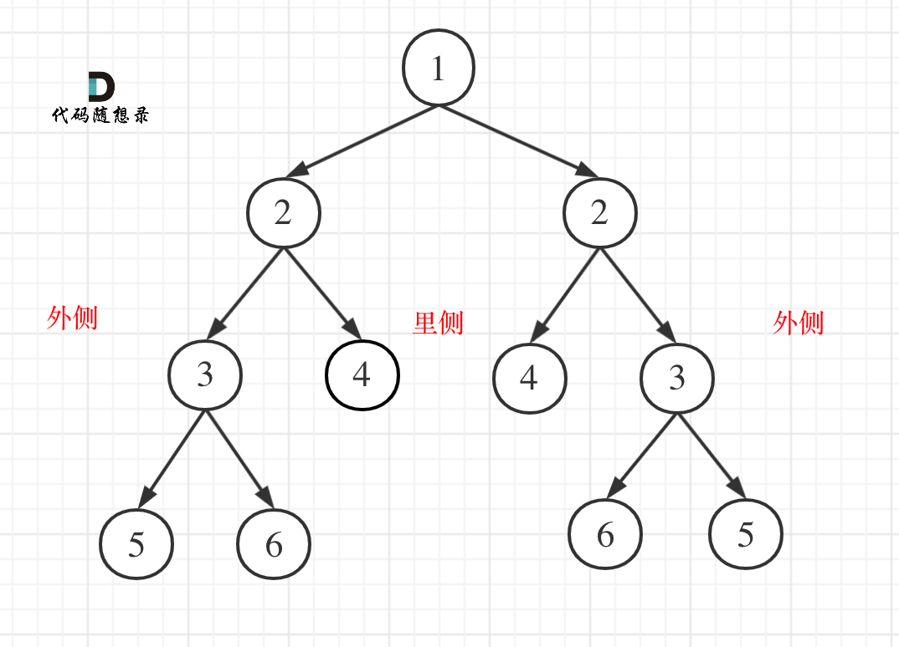
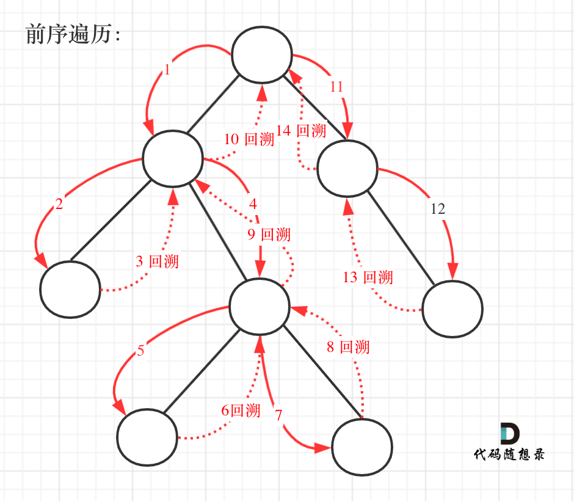
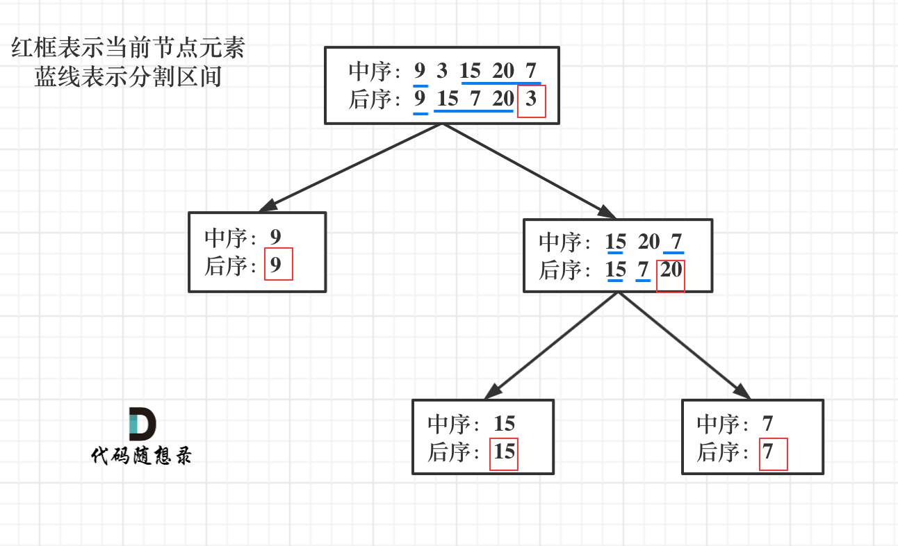
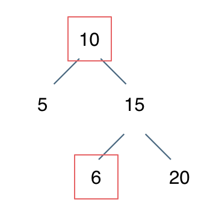

# 基础知识

## 二叉树的种类

### 满二叉树

如果一棵二叉树只有度为0的结点和度为2的结点，并且度为0的结点在同一层上，则这棵二叉树为满二叉树。


这棵二叉树为满二叉树，也可以说深度为k，有$2^{k-1}$个节点的二叉树。


### 完全二叉树

在完全二叉树中，除了最底层节点可能没填满外，其余每层节点数都达到最大值，并且最下面一层的节点都集中在该层最左边的若干位置。若最底层为第 h 层（h从1开始），则该层包含 $1$~ $2^{h-1}$ 个节点。


### 二叉搜索树

二叉搜索树是一个有序树。

- 若它的左子树不空，则左子树上所有结点的值均小于它的根结点的值；
- 若它的右子树不空，则右子树上所有结点的值均大于它的根结点的值；
- 它的左、右子树也分别为二叉排序树


### 平衡二叉搜索树

又被称为AVL（Adelson-Velsky and Landis）树，且具有以下性质：它是一棵空树或它的左右两个子树的高度差的绝对值不超过1，并且左右两个子树都是一棵平衡二叉树。


## 二叉树的存储方式

可以**链式存储**，也可以**顺序存储**。

链式存储方式就用指针， 顺序存储的方式就是用数组。

| 链式存储                 | 顺序存储                 |
|----------------------|----------------------|
| 指针                   | 数组                   |
|  |  |

其中，顺序存储中，父节点的数组下标是 i，那么它的左孩子就是 $i * 2 + 1$，右孩子就是 $i * 2 + 2$。

## 二叉树的遍历方式

**深度优先遍历**：先往深走，遇到叶子节点再往回走。

- 前序遍历（递归法，迭代法）
- 中序遍历（递归法，迭代法）
- 后序遍历（递归法，迭代法）

这里前中后，其实指的就是**中间节点**的遍历顺序


**广度优先遍历**：一层一层的去遍历。

- 层次遍历（迭代法）

## 二叉树的定义

```java

public class TreeNode{
    int val;
    TreeNode left;
    TreeNode right;
    
    TreeNode(){}
    TreeNode(int val){this.val = val;}
    TreeNode(int val, TreeNode left, TreeNode right){
        this.val = val;
        this.left = left;
        this.right = right;
    }
}
```

```python
class TreeNode:
    def __init__(self, val, left=None, right=None):
        self.val = val
        self.left = left
        self.right = right
```

# 递归遍历

递归算法的三个要素：

- 确定递归函数的参数和返回值： 确定哪些参数是递归的过程中需要处理的，那么就在递归函数里加上这个参数， 并且还要明确每次递归的返回值是什么进而确定递归函数的返回类型。

- 确定终止条件： 写完了递归算法, 运行的时候，经常会遇到栈溢出的错误，就是没写终止条件或者终止条件写的不对，操作系统也是用一个栈的结构来保存每一层递归的信息，如果递归没有终止，操作系统的内存栈必然就会溢出。

- 确定单层递归的逻辑： 确定每一层递归需要处理的信息。在这里也就会重复调用自己来实现递归的过程。

## 589.N叉树的前序遍历

思路是一样的，就是要加一个判断

```java
if(root.childen != null){
    for(Node child: root.childen){
        preorder(child,result);
    }
}

```

# 层序遍历

其实就是图论里的广度优先遍历

需要借用一个辅助数据结构即队列来实现，**队列先进先出，符合一层一层遍历的逻辑**，而用**栈先进后出适合模拟深度优先遍历也就是递归的逻辑**。


步骤：
1. 将根节点入队
2. 当队列不为空时：
   1. 处理当前层的所有节点
   2. 将下一层的所有节点入队

## 199.二叉树的右视图

层序遍历的时候，判断是否遍历到单层的最后面的元素，如果是，就放进result数组中，随后返回result就可以了。


## 637.二叉树的层平均值

本题就是层序遍历的时候把一层求个总和再取一个均值。

## 515.在每个树行中找最大值

## 116.填充每个节点的下一个右侧节点指针 & 117.

依然是层序遍历，只不过在单层遍历的时候记录一下本层的头部节点，然后在遍历的时候让前一个节点指向本节点就可以了

## 104.二叉树的最大深度 & 111.二叉树的最小深度

使用迭代法的话，使用层序遍历是最为合适的，因为最大的深度就是二叉树的层数，和层序遍历的方式极其吻合。

当要求二叉树的最小深度时，只有当左右孩子都为空的时候，才说明遍历的最低点了。如果其中一个孩子为空则不是最低点。

# 226.翻转二叉树

注意！交换的是指针，而不是数值

其实就是把每个节点的两个子节点进行交换。

我用的是层序遍历，用前序和后序遍历也可以做，中序遍历要麻烦一点，某些节点的左右孩子会翻转两次，要特殊处理一下。

# 101. 对称二叉树

首先想清楚，**判断对称二叉树要比较的是哪两个节点，要比较的可不是左右节点**！

其实我们**要比较的是两个树（这两个树是根节点的左右子树）**，所以在递归遍历的过程中，也是要同时遍历两棵树。

## 递归



本题遍历只能是“后序遍历”，因为我们要通过递归函数的返回值来判断两个子树的内侧节点和外侧节点是否相等。

正是因为要遍历两棵树而且要比较内侧和外侧节点，所以准确的来说是一个树的遍历顺序是左右中，一个树的遍历顺序是右左中。

但都可以理解算是后序遍历，尽管已经不是严格上在一个树上进行。

## 递归法

递归三部曲

1. 确定递归函数的参数和返回值

因为我们要比较的是根节点的两个子树是否是相互翻转的，进而判断这个树是不是对称树，所以**要比较的是两个树，参数自然也是左子树节点和右子树节点**。

返回值自然是bool类型。

2. 确定终止条件

要比较两个节点数值相不相同，首先要把两个节点为空的情况弄清楚！否则后面比较数值的时候就会操作空指针了。

节点为空的情况有：（注意我们比较的其实不是左孩子和右孩子，所以如下我称之为左节点右节点）

- 左节点为空，右节点不为空，不对称，return false
- 左不为空，右为空，不对称 return false
- 左右都为空，对称，返回true

- 此时已经排除掉了节点为空的情况，那么剩下的就是左右节点不为空： 左右都不为空，比较节点数值，不相同就return false

此时左右节点不为空，且数值也不相同的情况我们也处理了。

3. 确定单层递归的逻辑

此时才进入单层递归的逻辑，单层递归的逻辑就是处理 左右节点都不为空，且数值相同的情况。

- 比较二叉树外侧是否对称：传入的是左节点的左孩子，右节点的右孩子。
- 比较内侧是否对称，传入左节点的右孩子，右节点的左孩子。
- 如果左右都对称就返回true ，有一侧不对称就返回false 。


# 110.平衡二叉树

**深度：从根节点开始，自上而下测量。**

**高度：从叶子节点开始，自下而上测量。**

这道题要求高度，所以采用后序遍历比较好。

仍然可以使用递归法和迭代法两种。

1. 明确递归函数的参数和返回值

参数：当前传入节点。 返回值：以当前传入节点为根节点的树的高度。

那么如何标记左右子树是否差值大于1呢？

如果当前传入节点为根节点的二叉树已经不是二叉平衡树了，还返回高度的话就没有意义了。

所以如果已经不是二叉平衡树了，可以返回-1 来标记已经不符合平衡树的规则了。

2. 明确终止条件

递归的过程中依然是遇到空节点了为终止，返回0，表示当前节点为根节点的树高度为0。

3. 明确单层递归的逻辑

如何判断以当前传入节点为根节点的二叉树是否是平衡二叉树呢？当然是其左子树高度和其右子树高度的差值。

分别求出其左右子树的高度，然后如果差值小于等于1，则返回当前二叉树的高度，否则返回-1，表示已经不是二叉平衡树了。

# 257. 二叉树的所有路径

要返回从根节点到所有叶子节点（即没有左右孩子节点的节点）的所有路径



递归法
1. 递归函数参数以及返回值

要传入根节点、存放每一条路径的列表、存放结果的列表，这里不需要返回值

2. 确定递归终止条件

在写递归的时候都习惯了这么写：
```
if (cur == NULL) {
   终止处理逻辑
}
```

但是本题的终止条件这样写会很麻烦，因为本题要**找到叶子节点，就开始结束的处理逻辑了**（把路径放进result里）。

那么什么时候算是找到了叶子节点？ 是**当 cur不为空，其左右孩子都为空的时候，就找到叶子节点**。

所以本题的终止条件是：
```
if (cur->left == NULL && cur->right == NULL) {
   终止处理逻辑
}
```

为什么没有判断cur是否为空呢，因为递归的逻辑可以控制空节点不入循环。

3. 确定单层递归逻辑

因为是前序遍历，需要先处理中间节点，中间节点就是我们要记录路径上的节点，先放进path中。

然后是递归和回溯的过程，上面说过没有判断cur是否为空，那么在这里递归的时候，如果为空就不进行下一层递归了。

所以递归前要加上判断语句，下面要递归的节点是否为空。

递归完，要做回溯啊，因为path不能一直加入节点，它还要删节点，然后才能加入新的节点。

**回溯和递归是一一对应的，有一个递归，就要有一个回溯，所以回溯要和递归永远在一起**。

# 404.左叶子之和

首先要注意是判断左叶子，不是二叉树左侧节点，所以不要上来想着层序遍历。

节点A的左孩子不为空，且左孩子的左右孩子都为空（说明是叶子节点），那么A节点的左孩子为左叶子节点

判断当前节点是不是左叶子是无法判断的，必须要通过节点的父节点来判断其左孩子是不是左叶子。因为在左孩子节点自身，它无法知道自己是左孩子还是右孩子。

可以用层序遍历，也可以用递归。

# 513.找树左下角的值 (findBottomLeftValue)

用层序遍历最简单，就是记录最后一行的第一个元素

# 112. 路径总和 (hasPathSum)

这个也是找叶子节点，逻辑和404差不多，就是最后返回的是个布尔值，而不是字符串列表。

但需要注意的是，处理子递归的返回值，**当子递归找到符合条件的路径时，这个结果需要向上传播到根节点**。

事实上还可以更简单，这里不需要维护整个路径列表，可以直接累积和。(hasPathSum02)


| 特征      | 	int currentSum（值传递） | List<Integer> paths（引用传递） |
|---------|----------------------|---------------------------|
| 传递方式    | 	传递值的副本              | 	传递对象引用                   |
| 修改影响    | 	只影响当前栈帧	            | 影响所有共享该引用的栈帧              |
| 是否需要回溯	 | 不需要（自动）              | 	需要手动回溯                   |
| 内存使用    | 	每个栈帧有自己的副本          | 	所有栈帧共享同一个对象              |

# 113. 路径总和Ⅱ(hasPathSumⅡ)

**注意：**

**在Java中，List是引用类型**。当你执行 `result.add(path)` 时，你实际上是**将 `path` 列表的引用添加到了 `result` 中**，而不是列表的副本。

随着递归的进行，你会不断修改同一个 path 列表（通过 add 和 remove 操作）。当递归结束时，path 列表会变成空列表（因为所有元素都被移除了），所以 result 中所有的路径最终都会指向同一个空列表。

# 106. 从中序与后序遍历序列构造二叉树 (buildTree)

根据一棵树的中序遍历与后序遍历构造二叉树。



这道题还是很巧妙的，需要掌握的规律是：

1. 因为后序遍历最后一个肯定是根节点，所以可以确认根节点。
2. 通过根节点，可以在中序遍历中切分出左右子树
3. 然后根据左子树，可以在后序遍历中，又切割出左右子树
4. 这时候就进入递归了，根据后序遍历序列的左右子树中，再次找到下一个根节点。递归下去

**注意确定切割的标准**，是左闭右开，还有左开右闭，还是左闭右闭，这个就是不变量，要在递归中保持这个不变量。

写代码时分为以下几步：

* 第一步：如果数组大小为零的话，说明是空节点了。

* 第二步：如果不为空，那么取后序数组最后一个元素作为节点元素。

* 第三步：找到后序数组最后一个元素在中序数组的位置，作为切割点

* 第四步：切割中序数组，切成中序左数组和中序右数组 （顺序别搞反了，一定是先切中序数组）

* 第五步：切割后序数组，切成后序左数组和后序右数组

* 第六步：递归处理左区间和右区间

# 654. 最大二叉树 (constructMaximumBinaryTree)

这道题和上一道题差不多

# 617.合并二叉树 (mergeTrees)

因为这道题没有说必须新建一棵树，所以可以把第二棵树合并到第一棵树

# 700. 二叉搜索树中的搜索 (searchBST)

返回的是以该节点为根节点的子树

注意！！此处用的是二叉搜索树，和普通的二叉树不一样！可以利用二叉搜索树的特性，这样时间复杂度能降到$O(h)$，其中h是树的高度

# 98. 验证二叉搜索树 (isValidBST)

有陷阱！

**陷阱1**：不能单纯的比较左节点小于中间节点，右节点大于中间节点就完事了。我们要比较的是 左子树所有节点小于中间节点，右子树所有节点大于中间节点。

例如： [10,5,15,null,null,6,20] 这个就是错误的二叉搜索树



**陷阱2**：样例中最小节点 可能是int的最小值，如果这样使用最小的int来比较也是不行的。 此时可以初始化比较元素为long的最小值。、

有一种方法是可以递归中序遍历将二叉搜索树转变成一个数组，然后判断这个数组是不是严格单调递增的。

另一种方法是使用范围约束

还有一种方法是使用中序遍历验证。

# 530.二叉搜索树的最小绝对差 (getMinimumDifference)

这道题可以使用双指针遍历。

遇到在二叉搜索树上求什么最值，求差值之类的，都要思考一下二叉搜索树可是有序的，要利用好这一特点。

同时要学会在递归遍历的过程中如何记录前后两个指针，这也是一个小技巧，学会了还是很受用的。

**注意！**

Java中基本数据类型（int）是值传递，在递归函数中修改result不会影响外层变量的值。

这一块Java基础没学好！要再补一下。

# 501. 二叉搜索树中的众数 (findMode)

