# 基础

**动规五部曲：**

1. 确定dp数组（dp table）以及下标的含义
2. 确定递推公式
3. dp数组如何初始化
4. 确定遍历顺序
5. 举例推导dp数组

如果代码写出来了，一直AC不了，灵魂三问：

1. 这道题目我举例推导状态转移公式了么？
2. 我打印dp数组的日志了么？
3. 打印出来了dp数组和我想的一样么？

# 70. 爬楼梯 (climbStairs)

爬到第一层楼梯有一种方法，爬到二层楼梯有两种方法。

那么第一层楼梯再跨两步就到第三层 ，第二层楼梯再跨一步就到第三层。

所以到第三层楼梯的状态可以由第二层楼梯 和 到第一层楼梯状态推导出来，那么就可以想到动态规划了。

五部曲开始

1.  确定dp数组以及下标的含义

    dp`[i]`： 爬到第`i`层楼梯，有`dp[i]`种方法

2. 确定递推公式

    如何可以推出`dp[i]`呢？

    从`dp[i]`的定义可以看出，`dp[i]` 可以有两个方向推出来。

    首先是`dp[i - 1]`，上`i-1`层楼梯，有`dp[i - 1]`种方法，那么再一步跳一个台阶不就是`dp[i]`了么。

    还有就是`dp[i - 2]`，上`i-2`层楼梯，有`dp[i - 2]`种方法，那么再一步跳两个台阶不就是`dp[i]`了么。

    那么`dp[i]`就是 `dp[i - 1]`与`dp[i - 2]`之和！

    所以`dp[i] = dp[i - 1] + dp[i - 2]` 。

3. dp数组如何初始化

    再回顾一下`dp[i]`的定义：爬到第`i`层楼梯，有`dp[i]`种方法。

    那么i为0，dp[i]应该是多少

    好像是有争议的。

    不考虑`dp[0]`如何初始化，只初始化`dp[1] = 1`，`dp[2] = 2`，然后从i = 3开始递推，这样才符合`dp[i]`的定义。

4. 确定遍历顺序

    从递推公式`dp[i] = dp[i - 1] + dp[i - 2]`;中可以看出，遍历顺序一定是从前向后遍历的

5. 举例推导dp数组

    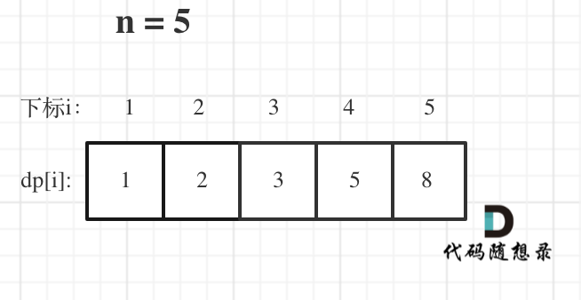


时间复杂度：$O(n)$

空间复杂度：$O(n)$

# 746. 使用最小花费爬楼梯 (minCostClimbingStairs)

1. 确定dp数组以及下标的含义

    dp[i]的定义：到达第i台阶所花费的最少体力为dp[i]。

2. 确定递推公式
   
    可以有两个途径得到`dp[i]`，一个是`dp[i-1]` 一个是`dp[i-2]`。

    `dp[i - 1]` 跳到 `dp[i]` 需要花费 `dp[i - 1] + cost[i - 1]`。
    
    `dp[i - 2]` 跳到 `dp[i]` 需要花费 `dp[i - 2] + cost[i - 2]`。
    
    那么究竟是选从`dp[i - 1]`跳还是从`dp[i - 2]`跳呢？
    
    一定是选最小的，所以`dp[i] = min(dp[i - 1] + cost[i - 1], dp[i - 2] + cost[i - 2])`;

3. dp数组如何初始化

    只初始化dp[0]和dp[1]就够了，其他的最终都是dp[0]和dp[1]推出

4. 确定遍历顺序

   `dp[i]`由`dp[i-1]` `dp[i-2]`推出，所以是从前到后遍历`cost`数组就可以了。

5. 举例推导dp数组

    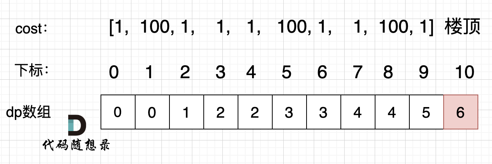

时间复杂度：$O(n)$

空间复杂度：$O(n)$

# 62.不同路径 (uniquePaths)

这道题最直观看上去就是用图论里的深度优先搜索dfs，也确实是个解题思路。

但这里先看动规吧。

机器人从(0 , 0) 位置出发，到(m - 1, n - 1)终点。

按照动规五部曲来分析：

1. 确定dp数组（dp table）以及下标的含义

    dp[i][j] ：表示从（0 ，0）出发，到(i, j) 有dp[i][j]条不同的路径。

2. 确定递推公式

    想要求dp[i][j]，只能有两个方向来推导出来，即dp[i - 1][j] 和 dp[i][j - 1]。

    此时在回顾一下 dp[i - 1][j] 表示啥，是从(0, 0)的位置到(i - 1, j)有几条路径，dp[i][j - 1]同理。

    那么很自然，dp[i][j] = dp[i - 1][j] + dp[i][j - 1]，因为dp[i][j]只有这两个方向过来。

3. dp数组的初始化

    如何初始化呢，首先dp[i][0]一定都是1，因为从(0, 0)的位置到(i, 0)的路径只有一条，那么dp[0][j]也同理。

    所以初始化代码为：

    ```java
    for (int i = 0; i < m; i++) dp[i][0] = 1;
    for (int j = 0; j < n; j++) dp[0][j] = 1;
    ```

4. 确定遍历顺序

    这里要看一下递推公式dp[i][j] = dp[i - 1][j] + dp[i][j - 1]，dp[i][j]都是从其上方和左方推导而来，那么从左到右一层一层遍历就可以了。

    这样就可以保证推导dp[i][j]的时候，dp[i - 1][j] 和 dp[i][j - 1]一定是有数值的。

5. 举例推导dp数组

    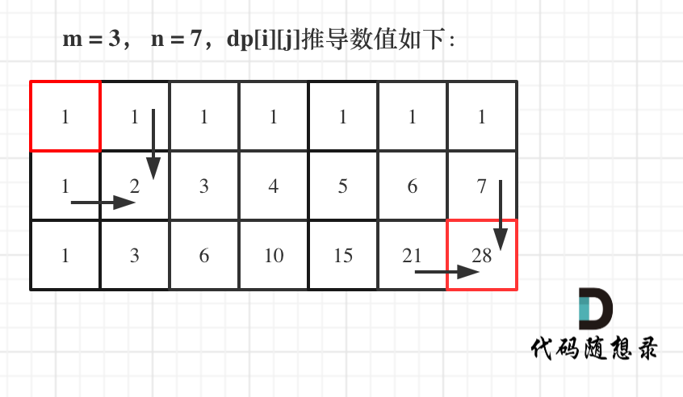

# 63. 不同路径 II (uniquePathsWithObstacles)

**注意！！**

从(0,0)开始，如果没有障碍物则设为1，一旦遇到障碍物，后面的全部设为0

# 343. 整数拆分 (integerBreak)

1. 确定dp数组（dp table）以及下标的含义

   dp[i]：分拆数字i，可以得到的最大乘积为dp[i]。
   
   dp[i]的定义将贯彻整个解题过程，下面哪一步想不懂了，就想想dp[i]究竟表示的是啥！

2. 确定递推公式

   可以想 dp[i]最大乘积是怎么得到的呢？
   
   其实可以从1遍历j，然后有两种渠道得到dp[i].
   
   一个是j * (i - j) 直接相乘。
   
   一个是j * dp[i - j]，相当于是拆分(i - j)，对这个拆分不理解的话，可以回想dp数组的定义。
   
   那有同学问了，j怎么就不拆分呢？
   
   j是从1开始遍历，拆分j的情况，在遍历j的过程中其实都计算过了。那么从1遍历j，比较(i - j) * j和dp[i - j] * j 取最大的。递推公式：dp[i] = max(dp[i], max((i - j) * j, dp[i - j] * j));
   
   也可以这么理解，j * (i - j) 是单纯的把整数拆分为两个数相乘，而j * dp[i - j]是拆分成两个以及两个以上的个数相乘。

   对于较小的数，拆分的乘积反而小于不拆分的原数。

   递推公式传入的取最大值的三个值的含义分别是：

   1. 历史最优（dp[i]）：保存当前找到的最佳结果。因为对于每个 i，我们要尝试多种拆分方式（多个 j 值），取其中最大值，所以需要保存下来，以便跟下一个拆分版本作比较。

   2. 拆成两部分（(i-j)×j）：最简单的拆分。当剩余部分较小的时候，拆分的乘积反而小于不拆分的原数。

   3. 拆成多部分（j×dp[i-j]）：第一个数不拆，后面的继续拆

3. dp的初始化

   严格从dp[i]的定义来说，dp[0] dp[1] 就不应该初始化，也就是没有意义的数值。

   这里我只初始化dp[2] = 1，从dp[i]的定义来说，拆分数字2，得到的最大乘积是1

4. 确定遍历顺序

   确定遍历顺序，先来看看递归公式：`dp[i] = max(dp[i], max((i - j) * j, dp[i - j] * j))`;

   dp[i] 是依靠 dp[i - j]的状态，所以遍历i一定是从前向后遍历，先有dp[i - j]再有dp[i]。

   所以遍历顺序为：

   ```java
   for (int i = 3; i <= n ; i++) {
    for (int j = 1; j < i - 1; j++) {
        dp[i] = max(dp[i], max((i - j) * j, dp[i - j] * j));
    }
   }
   ```

   注意 枚举j的时候，是从1开始的。从0开始的话，那么让拆分一个数拆个0，求最大乘积就没有意义了。

5. 举例推导dp数组

# 96.不同的二叉搜索树 (numTrees)

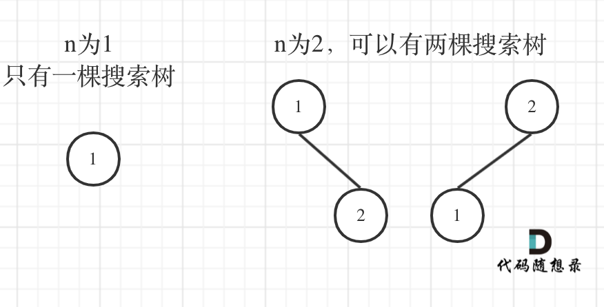

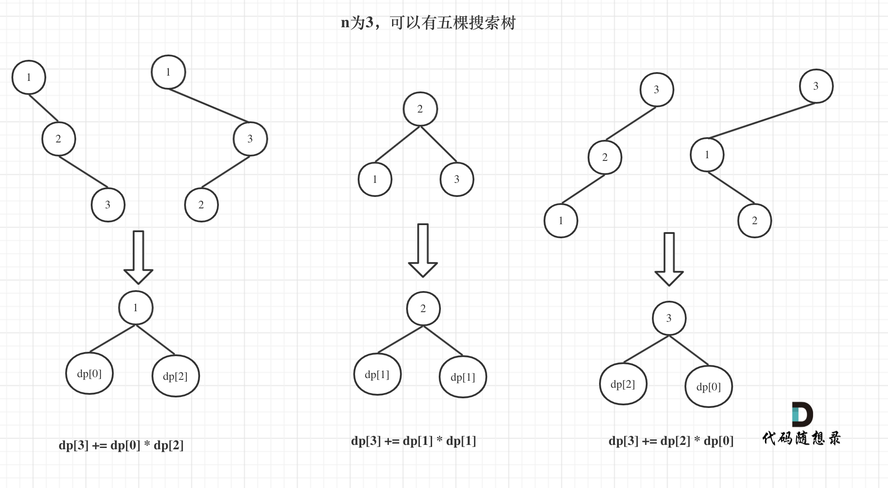

因为这道题只考虑数目，所以当1为头结点的时候，其右子树有两个节点，这两个节点的布局和 n 为2的时候两棵树的布局是一样的。

1. 确定dp数组（dp table）以及下标的含义

   dp[i] ： 1到i为节点组成的二叉搜索树的个数为dp[i]。

2. 确定递推公式

   在上面的分析中，其实已经看出其递推关系， dp[i] += dp[以j为头结点左子树节点数量] * dp[以j为头结点右子树节点数量]
   
   j相当于是头结点的元素，从1遍历到i为止。

3. dp数组如何初始化
   
   初始化，只需要初始化dp[0]就可以了，推导的基础，都是dp[0]。

4. 确定遍历顺序
   
   首先一定是遍历节点数，从递归公式：dp[i] += dp[j - 1] * dp[i - j]可以看出，节点数为i的状态是依靠 i之前节点数的状态。

   那么遍历i里面每一个数作为头结点的状态，用j来遍历。

# 背包问题


## 0/1背包问题
| 物品名 | 重量 | 价值 |
|-----|----|----|
| 物品0 | 1  | 15 |
| 物品1 | 3  | 20 |
| 物品2 | 4  | 30 |

背包最大的容量是4

**一定要搞清楚`dp[i][j]`数组的含义！**

dp数组含义是：从下标为`[0-i]`的物品里任意取，放进容量为`j`的背包，价值总和最大是多少。

动态规划的思路是根据子问题的求解推导出整体的最优解。

先看把物品0 放入背包的情况：

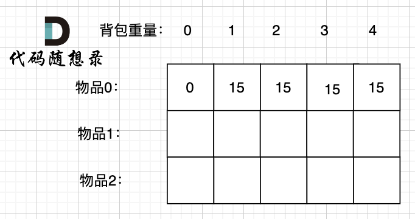

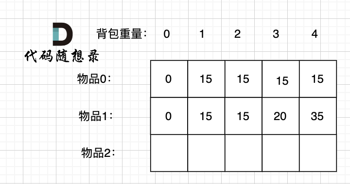

再来递推公式。

`物品i`有两种状态：放和不放。

如果背包里不放`物品i`，那么最大价值为`dp[i-1][j]`；

如果放`物品i`，那么最大价值就是`不放物品i的最大价值+物品i的价值`，即`dp[i-1][j-weight[i]] + value[i]`，注意背包的容量也要减。

所以递推公式就是：`dp[i][j] = max(dp[i-1][j], dp[i-1][j-weight[i]] + value[i])`

初始化。

当背包容量为0时，所有物品都放不下，所以`dp[i][0]`都为0。

然后初始化`dp[1][j]`，根据`weight[0]`来判断`dp[0][j]`是多少

遍历顺序。

第一层for循环遍历物品，第二层for循环遍历背包容量。

vs

第一层for循环遍历背包容量，第二层for循环遍历物品。

这两个都是一样的，因为`dp[i][j]`来源于`dp[i-1][j]`（正上方）和`dp[i-1][j-weight[i]]`（左上方），所以只要保证这两个地方有值，就能推导出来。

---
上面都是二维dp数组，也可以用一维dp滚动数组来用

因为`dp[i][j]`的来源是上一层，所以可以看作把上一层拷贝下来，再在本层进行替换

简化为`dp[j]`，含义是：容量为`j`的背包所含物品最大价值为`dp[j]`

递推公式为`dp[j] = max(dp[j], dp[j-weight[i]] + value[i])`

初始化：`dp[0]=0`，其他的只要初始化成非负数就行了，即`dp[j] = 0`

遍历的时候，物品遍历的for循环放在外层，遍历背包的for循环放在内层，且**内层for循环倒序遍历**！

因为新一层的数据是拷贝上一层的数据，如果是正序遍历的话，用的数据就是从左边来的新算出来的数据，而不是上一层的旧数据了。

### 416. 分割等和子集 (canPartition)

用一维dp数组

- 时间复杂度：$O(n^2)$
- 空间复杂度：$O(n)$，虽然dp数组大小为一个常数，但是大常数

### 1049.最后一块石头的重量II (lastStoneWeightII)

和上一道题相同，可以看作其实是尽量让石头分成重量相同的两堆（尽可能相同），相撞之后剩下的石头就是最小的。

一堆的石头重量是sum，那么我们就尽可能拼成 重量为 sum / 2 的石头堆。 这样剩下的石头堆也是 尽可能接近 sum/2 的重量。 那么此时问题就是有一堆石头，每个石头都有自己的重量，是否可以 装满 最大重量为 sum / 2的背包。

- 时间复杂度：$O(m × n)$ , m是石头总重量（准确的说是总重量的一半），n为石头块数
- 空间复杂度：$O(m)$

### 494.目标和 (findTargetSumWays_BACKTRACK)

这道题也是把数分成两个集合，加法一个集合，减法一个集合。

本题要如何使表达式结果为target，

既然为target，那么就一定有 left组合 - right组合 = target。

left + right = sum，而sum是固定的。right = sum - left

left - (sum - left) = target 推导出 left = (target + sum)/2 。

target是固定的，sum是固定的，left就可以求出来。

此时问题就是在集合nums中找出和为left的组合。

### 474.一和零 (findMaxForm)

涉及到m和n两个参数，所以一维dp数组满足不了了。

## 完全背包问题

有`N`件物品和一个最多能背重量为`W`的背包。第`i`件物品的重量是`weight[i]`，得到的价值是`value[i]` 。每件物品都有无限个（也就是可以放入背包多次），求解将哪些物品装入背包里物品价值总和最大。

**完全背包和01背包问题唯一不同的地方就是，每种物品有无限件。**

遍历顺序：

先遍历背包或者先遍历物品都可以。遍历背包变成了正序。

### 518.零钱兑换II (change)

类似这种题目：**给出一个总数，一些物品，问能否凑成这个总数**。

这是典型的背包问题！

因为每一种面额的硬币有无限个，所以这是完全背包。

但这道题的遍历顺序是重要的！！！

#### 核心区别：状态表示的方式不同

##### 二维数组的情况
在二维DP中，状态 `dp[i][j]` 明确表示：
- **只使用前 i 种硬币**（coins[0] 到 coins[i]）
- 凑成金额 j 的组合数

因为状态定义中已经包含了"使用哪些硬币"的信息，所以：
1. **物品维度被显式保留**：`i` 代表使用了哪些硬币
2. **状态转移时，硬币的顺序是固定的**：总是先处理coins[0]，再coins[1]...
3. **不会重复计算排列**：因为 `dp[i][j]` 只考虑前 i 种硬币，无论遍历顺序如何，都不会把 `{2, 1}` 和 `{1, 2}` 当作不同的组合

示例：coins = [1, 2, 5]
```
// 先遍历物品，再遍历背包
for i in [1,2,5]:  // 固定硬币顺序
    for j in [0..amount]:
        dp[i][j] = dp[i-1][j] + dp[i][j-coins[i]]
        
// 先遍历背包，再遍历物品  
for j in [0..amount]:
    for i in [1,2,5]:  // 依然是按硬币顺序处理
        dp[i][j] = dp[i-1][j] + dp[i][j-coins[i]]
```

两种遍历顺序下，计算 `dp[2][3]`（使用前2种硬币凑3元）时：
- 都只会考虑 {1,1,1} 和 {1,2} 这两种组合
- 不会考虑 {2,1}，因为这需要先处理硬币2再处理硬币1

##### 一维数组的情况
在一维DP中，状态 `dp[j]` 表示：
- **凑成金额 j 的组合数**
- **但是失去了"使用了哪些硬币"的信息**

这时候遍历顺序就变得至关重要：

###### 情况1：外层遍历物品（正确，得到组合数）
```cpp
for (int i = 0; i < coins.size(); i++) { // 遍历物品
    for (int j = coins[i]; j <= amount; j++) { // 遍历背包
        dp[j] += dp[j - coins[i]];
    }
}
```
**工作方式：**
- 硬币1处理所有背包容量 → 记录只用硬币1的组合
- 硬币2处理所有背包容量 → 在硬币1的基础上添加硬币2
- **硬币顺序固定**：总是1在前，2在后
- **结果**：`{1,2}` 会计算，`{2,1}` 不会计算（因为2不可能出现在1之前）

###### 情况2：外层遍历背包（错误，得到排列数）
```cpp
for (int j = 0; j <= amount; j++) { // 遍历背包
    for (int i = 0; i < coins.size(); i++) { // 遍历物品
        if (j >= coins[i]) dp[j] += dp[j - coins[i]];
    }
}
```
**工作方式（以计算 dp[3] 为例）：**
```
金额3的计算过程：
- 考虑硬币1：dp[3] += dp[2]（使用硬币1结尾）
- 考虑硬币2：dp[3] += dp[1]（使用硬币2结尾）

金额2的计算过程：
- 考虑硬币1：dp[2] += dp[1]（使用硬币1结尾）
- 考虑硬币2：dp[2] += dp[0]（使用硬币2结尾）

金额1的计算过程：
- 考虑硬币1：dp[1] += dp[0]（使用硬币1结尾）
- 考虑硬币2：跳过（金额不够）
```

**结果**：
- `dp[3]` 通过 `dp[1] + 硬币2` 得到 {1,2}
- `dp[3]` 通过 `dp[2] + 硬币1` 得到 {2,1}
- **重复计算了排列**！

#### 为什么一维DP会失去信息？

因为一维DP本质上是在**原地更新**数组。当计算 `dp[j]` 时，它已经包含了**所有可能硬币顺序**的结果。

对比二维和一维的状态转移：

**二维：**
```
dp[i][j] = dp[i-1][j] + dp[i][j-coins[i]]
      ↑           ↑           ↑
    当前状态    不用硬币i    用硬币i（但只能用前i种硬币）
```

**一维：**
```
dp[j] = dp[j] + dp[j-coins[i]]
   ↑        ↑           ↑
 更新后    更新前    可能包含所有硬币
```

在一维中，`dp[j-coins[i]]` 可能包含了**所有硬币**的组合，而不只是前 i 种硬币的组合。

#### 几何解释

##### 二维数组
想象一个表格：
```
   金额 0 1 2 3 4 5
硬币1
硬币2  
硬币3
```
- 每行只依赖于上一行和当前行的左侧
- 遍历顺序不影响依赖关系

##### 一维数组
想象一个一维的流水线：
```
dp: [0, 1, 2, 3, 4, 5]
```
- 如果外层遍历物品：每个物品"扫过"整个数组一次
- 如果外层遍历背包：每个金额位置"收集"所有物品的贡献

#### 关键结论

1. **二维DP**：遍历顺序无关，因为状态定义已经包含了硬币使用顺序的信息
2. **一维DP**：遍历顺序有关，因为状态定义丢失了硬币顺序信息，遍历顺序决定了硬币的使用顺序
   - 外层物品，内层背包 → 组合数（硬币顺序固定）
   - 外层背包，内层物品 → 排列数（允许任意顺序）

这就是为什么在零钱兑换 II（求组合数）问题中，使用一维DP时必须**外层遍历物品，内层遍历背包**。


### 377. 组合总和 Ⅳ (combinationSum4)

这道题是求排列的，和上一道题显著的不同就在这里。

**如果求组合数就是外层for循环遍历物品，内层for遍历背包**。

**如果求排列数就是外层for遍历背包，内层for循环遍历物品**。

遍历顺序,视角,核心特征,结果类型

外层物品，内层背包,物品导向,物品 1 处理完才处理物品 2，顺序固定,"组合（如 {1, 2}）"

外层背包，内层物品,容量导向,每个容量都重新选一遍所有物品，顺序随机,"排列（如 {1, 2} 和 {2, 1}）"

### 322. 零钱兑换 (coinChange)

这里dp数组初始化会有一些小巧思。需要初始化为永远无法达到的`amount+1`。

### 279.完全平方数 (numSquares)

### 139.单词拆分 (wordBreak)

1. 确定dp数组以及下标的含义
   `dp[i]` : 字符串长度为`i`的话，`dp[i]`为`true`，表示可以拆分为一个或多个在字典中出现的单词。

2. 确定递推公式 

   如果确定`dp[j]` 是`true`，且 `[j, i]` 这个区间的子串出现在字典里，那么`dp[i]`一定是`true`。（`j < i` ）。

   所以递推公式是 `if([j, i] 这个区间的子串出现在字典里 && dp[j]是true)` 那么 `dp[i] = true`。

3. dp数组如何初始化

   这里`dp[0] = true`，没有具体的意义，完全为了递推，否则后面将全部为`false`。

4. 确定遍历顺序

   这道题本质上是求排列，因为"apple" + "pen" = "applepen" 和 "pen" + "apple" = "penapple" 是不同的。
   
   所以先遍历背包，再遍历物品。

5. 举例推导dp[i]

   以输入: s = "leetcode", wordDict = ["leet", "code"]为例，dp状态如图：

   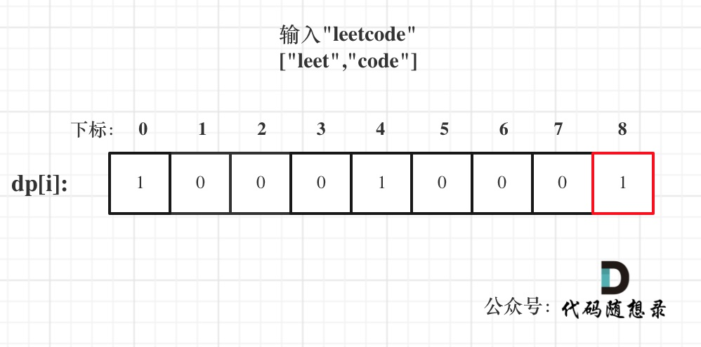

我的错误：

1. 贪心策略错误：使用`start`变量来记录上一个匹配的结束位置，但这是贪心策略，可能错过正确的分割方式。例如，`s="aaaaaaa", wordDict=["aaa","aaaa"]`，贪心可能先匹配了`aaa`导致后面无法匹配。

2. 循环逻辑问题：`for (int i = start; ...)` 这会导致只从`start`开始检查，但实际应该检查所有位置。

3. dp更新条件：你只在`dp[start]==1`时检查，但我们需要检查所有`dp[j]==1`的位置。

## 多重背包

有`N`种物品和一个容量为`V` 的背包。第`i`种物品最多有`M[i]`件可用，每件耗费的空间是`C[i]` ，价值是`W[i]` 。求解将哪些物品装入背包可使这些物品的耗费的空间 总和不超过背包容量，且价值总和最大。

多重背包和0/1背包是非常像的， 为什么和0/1背包像呢？

每件物品最多有`M[i]`件可用，把`M[i]`件摊开，其实就是一个0/1背包问题了。

## 背包问题总结

### 递推公式

问**能否能装满背包（或者最多装多少）**：`dp[j] = max(dp[j], dp[j - nums[i]] + nums[i])`;

问**装满背包有几种方法**：`dp[j] += dp[j - nums[i]]`;

问**背包装满最大价值**：`dp[j] = max(dp[j], dp[j - weight[i]] + value[i])`; 

问**装满背包所有物品的最小个数**：`dp[j] = min(dp[j - coins[i]] + 1, dp[j])`;

### 遍历顺序

0/1背包中，

二维dp数组先遍历物品还是先遍历背包都是可以的，且**第二层for循环是从小到大遍历**。

一维dp数组只能先遍历物品再遍历背包容量，且**第二层for循环是从大到小遍历**。

完全背包中，

纯完全背包的一维dp数组实现，先遍历物品还是先遍历背包都是可以的，且**第二层for循环是从小到大遍历**。

但是仅仅是纯完全背包的遍历顺序是这样的，题目稍有变化，两个for循环的先后顺序就不一样了。

如果**求组合数就是外层for循环遍历物品，内层for遍历背包**。

如果**求排列数就是外层for遍历背包，内层for循环遍历物品**。

## 198.打家劫舍 (rob)

当前房屋偷与不偷取决于 前一个房屋和前两个房屋是否被偷了。

所以这里就更感觉到，当前状态和前面状态会有一种依赖关系，那么这种依赖关系都是动规的递推公式。

1. 确定dp数组（dp table）以及下标的含义

   dp[i]：考虑下标i（包括i）以内的房屋，最多可以偷窃的金额为dp[i]。

2. 确定递推公式

   决定dp[i]的因素就是第i房间偷还是不偷。
   
   如果偷第i房间，那么dp[i] = dp[i - 2] + nums[i] ，即：第i-1房一定是不考虑的，找出 下标i-2（包括i-2）以内的房屋，最多可以偷窃的金额为dp[i-2] 加上第i房间偷到的钱。
   
   如果不偷第i房间，那么dp[i] = dp[i - 1]，即考 虑i-1房，（注意这里是考虑，并不是一定要偷i-1房，这是很多同学容易混淆的点）
   
   然后dp[i]取最大值，即dp[i] = max(dp[i - 2] + nums[i], dp[i - 1]);

3. dp数组如何初始化

   从递推公式dp[i] = max(dp[i - 2] + nums[i], dp[i - 1]);可以看出，递推公式的基础就是dp[0] 和 dp[1]
   
   从dp[i]的定义上来讲，dp[0] 一定是 nums[0]，dp[1]就是nums[0]和nums[1]的最大值即：dp[1] = max(nums[0], nums[1]);

4. 确定遍历顺序

   dp[i] 是根据dp[i - 2] 和 dp[i - 1] 推导出来的，那么一定是从前到后遍历！

5. 举例推导dp数组

## 213.打家劫舍II (robII)

对于成环的数组，有以下三种考虑方式：

- 考虑不包含首尾元素，`(i, j)`
- 考虑首，不考虑尾，`[i, j)`
- 考虑尾，不考虑首，`(i, j]`

而情况二+情况三包含了情况一，所以最后就是求情况二和情况三之间的最大值就行了

## 337.打家劫舍 III (robIII)

**树形递归**

1. 不偷当前节点：

   - 左子树的根节点：可以偷，也可以不偷

   - 右子树的根节点：可以偷，也可以不偷

   选择的原则是：取最大值

   所以：

   - 对于左子树：`Math.max(left[0], left[1])`（取左子树偷或不偷的最大值）
   
   - 对于右子树：`Math.max(right[0], right[1])`（取右子树偷或不偷的最大值）

   总和：左子树的最大值 + 右子树的最大值

2. 偷当前节点：

   那么左右子树的根节点都不能偷（避免相邻）
   
   所以只能取左右子树"不偷"的情况：`left[0] + right[0]`
   
   再加上当前节点的值：`root.val + left[0] + right[0]`

## 121. 买卖股票的最佳时机 (maxProfit)

`dp[i][0]` 表示第i天持有股票所得最多现金; `dp[i][1]` 表示第i天不持有股票所得最多现金

由递推公式 `dp[i][0] = max(dp[i - 1][0], -prices[i])`; 和 `dp[i][1] = max(dp[i - 1][1], prices[i] + dp[i - 1][0])`;可以看出

其基础都是要从`dp[0][0]`和`dp[0][1]`推导出来。

那么`dp[0][0]`表示第0天持有股票，此时的持有股票就一定是买入股票了，因为不可能有前一天推出来，所以`dp[0][0] -= prices[0]`;

`dp[0][1]`表示第0天不持有股票，不持有股票那么现金就是0，所以`dp[0][1] = 0`;

从递推公式可以看出dp[i]都是由dp[i - 1]推导出来的，那么一定是从前向后遍历。

注意，最后返回的一定是已经抛售了的状态，所以是`dp[prices.length-1][1]`

## 122.买卖股票的最佳时机II (maxProfitII)

和上一道题唯一不同的地方是，因为一只股票可以买卖多次，所以当第i天买入股票的时候，所持有的现金可能有之前买卖过的利润。

## 123.买卖股票的最佳时机III (maxProfitIII)

关键在于至多买卖两次，这意味着可以买卖一次，可以买卖两次，也可以不买卖。

（太难了，先跳过吧）

## 124.买卖股票的最佳时机IV

（好难，再跳）

## 309.最佳买卖股票时机含冷冻期 (maxProfitFreeze)

这道题加入了冷冻期，所以可以分为四个状态。

- 状态一：持有股票状态（今天买入股票，或者是之前就买入了股票然后没有操作，一直持有）

- 不持有股票状态，这里就有两种卖出股票状态

   - 状态二：保持卖出股票的状态（两天前就卖出了股票，度过一天冷冻期。或者是前一天就是卖出股票状态，一直没操作）
   - 状态三：今天卖出股票
  
- 状态四：今天为冷冻期状态，但冷冻期状态不可持续，只有一天！

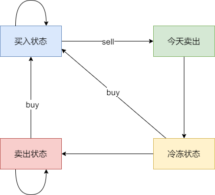

## 714. 买卖股票的最佳时机含手续费 (maxProfitFee)

在maxProfit的基础上减一个手续费

## 300.最长递增子序列 (lengthOfLIS)

注意：子序列不一定是连续的

所以`dp[i]`表示：以 `nums[i]` 结尾的最长递增子序列的长度，而不单纯是最长递增子序列的长度，不然都不知道是否以`nums[i]`结尾，那这样`i`将毫无意义。

对于每个位置 i，我们检查它前面所有的位置 j (0 ≤ j < i)：

   - 如果 nums[i] > nums[j]，说明 nums[i] 可以接在以 nums[j] 结尾的子序列后面
   
   - 那么以 nums[i] 结尾的最长子序列长度可能是 dp[j] + 1

   - 我们取所有可能的 j 中的最大值

**为什么需要 max(dp[i], dp[j] + 1)？**

因为可能有多个 j 都满足 nums[i] > nums[j]，我们需要找到其中最大的 dp[j] + 1。

例如：nums = [1, 3, 6, 7, 9, 4, 10, 5, 6]

- 处理 nums[6] = 10 时：
   
   - 可以接在 nums[5] = 4 后面（dp[5]可能是4）
   
   - 也可以接在 nums[4] = 9 后面（dp[4]可能是5）
   
   - 我们需要取最大的那个

**为什么需要两层循环？**

外层循环 (i)：遍历每个元素作为结尾

内层循环 (j)：对于每个 i，检查所有前面的元素 j，看能否接在后面

**dp[i]初始为1：因为每个元素本身就是一个长度为1的递增子序列**

## 674. 最长连续递增序列 (findLengthOfLCIS)

1. "断点"机制：

   - 当 nums[i] <= nums[i-1] 时，递增序列在这里"断开"
   
   - dp[i] 重置为 1
   
   - 新的递增序列可以从这里重新开始

2. 每个位置独立计算：

   - dp[i] 只依赖于 dp[i-1] 和 nums[i] 与 nums[i-1] 的比较
   
   - 不依赖于 dp[0] 或起始位置

3. 为什么能处理任意起点？

   - 因为状态转移只看相邻两个元素的关系
   
   - 只要 nums[i] > nums[i-1]，就可以延长前一个递增序列
   
   - 如果不符合，就从当前元素开始一个新的递增序列

## 718. 最长重复子数组 (findLength)

dp[i][j] will be the longest common prefix of A[i:] and B[j:]

## 1143.最长公共子序列 (longestCommonSubsequence)

dp[i][j] 表示 text1[i-1] text2[j-1]

坑：只能从左上角转移，才能保持顺序性。

## 1035.不相交的线 (maxUncrossedLines)

直线不能相交，这就是说明在字符串nums1中 找到一个与字符串nums2相同的子序列，且这个子序列不能改变相对顺序，只要相对顺序不改变，连接相同数字的直线就不会相交。

## 53. 最大子数组和 (maxSubArray)

## 392.判断子序列 (isSubsequence)


## 115. 不同的子序列 (numDistinct)

hard

## 583. 两个字符串的删除操作 (minDistance)

只要求出两个字符串的最长公共子序列长度即可，那么除了最长公共子序列之外的字符都是必须删除的，最后用两个字符串的总长度减去两个最长公共子序列的长度就是删除的最少步数。

## 72. 编辑距离 (minDistanceII)

## 647. 回文子串 (countSubstrings)

如果这道题定义dp[i] 为 下标i结尾的字符串有 dp[i]个回文串的话，会发现很难找到递归关系。

所以我们要寻找一个递归关系。

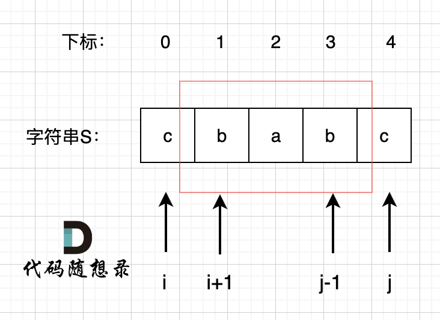

所以dp[i][j] 表示 s[i:j] 是回文子串。

## 516.最长回文子序列 (longestPalindromeSubseq)

分s[i] == s[j] 和 s[i] != s[j] 两种情况

如果s[i]与s[j]不相同，说明s[i]和s[j]的同时加入 并不能增加[i,j]区间回文子序列的长度，那么分别加入s[i]、s[j]看看哪一个可以组成最长的回文子序列。

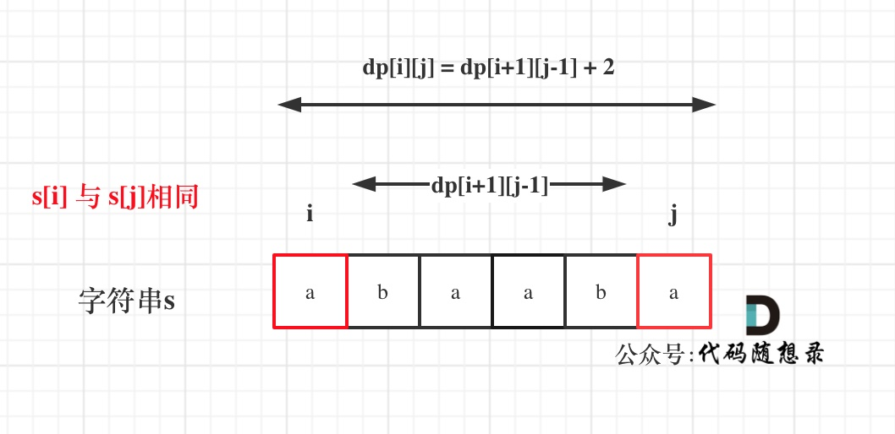

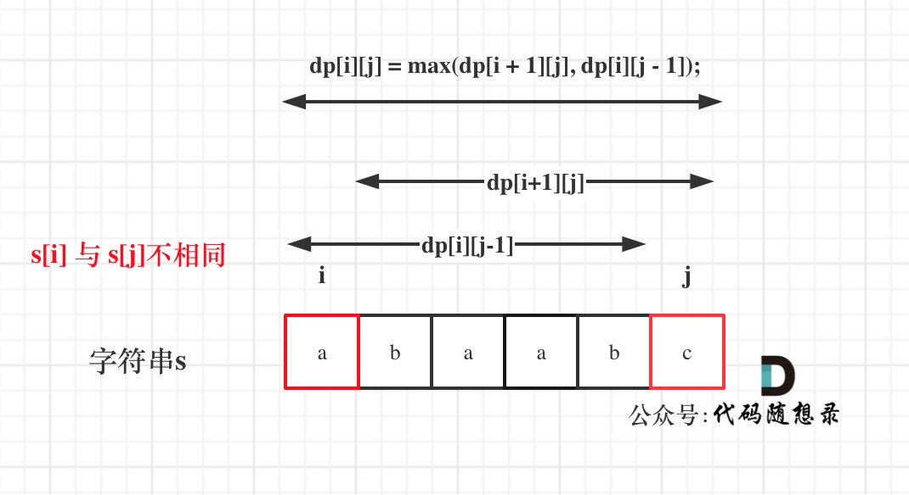

