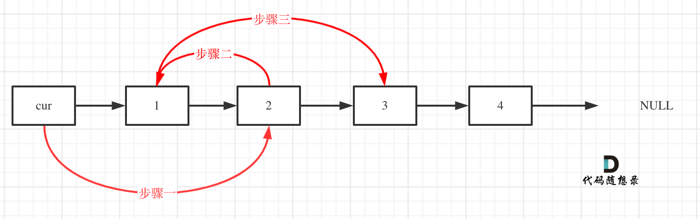

# 203. 移除链表元素

## 题目特征

- 移除链表元素
- 空间复杂度$O(1)$
- 时间复杂度$O(N)$

## 题目解法

让节点next指针直接指向下下一个节点就可以了

注意：

因为单链表的特殊性，只能指向下一个节点，那么如果删除的是头结点又该怎么办呢？

这里就涉及如下链表操作的两种方式：

- 直接使用原来的链表来进行删除操作。
- 设置一个**虚拟头结点**在进行删除操作。

事实上，linkedlist大部分题目都需要设置虚拟头结点

第一种操作：直接使用原来的链表来进行移除

只要将头结点向后移动一位就可以，这样就从链表中移除了一个头结点。

第二种操作：设置一个虚拟头结点

这样原链表的所有节点就都可以按照统一的方式进行移除了。

最后呢在题目中，return 头结点的时候，别忘了 `return dummyNode->next`;， 这才是新的头结点

## 其他链表题目

### 24. 两两交换链表中的节点

给定一个链表，两两交换其中相邻的节点，并返回交换后的链表。

你不能只是单纯的改变节点内部的值，而是需要实际的进行节点交换。

使用虚拟头结点，这样会方便很多，要不然每次针对头结点（没有前一个指针指向头结点），还要单独处理。

### 19. 删除链表的倒数第 N 个结点

双指针的经典应用，如果要删除倒数第n个节点，让`fast`移动`n`步，然后让`fast`和`slow`同时移动，直到`fast`指向链表末尾。删掉`slow`所指向的节点就可以了。

（我觉得这里判断终止条件还挺容易踩坑的）

