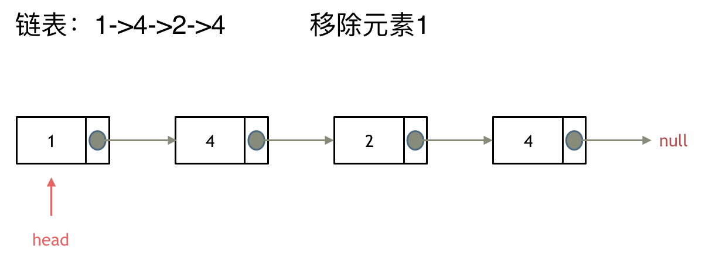
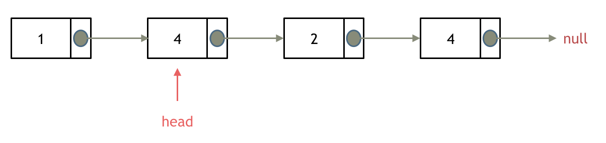
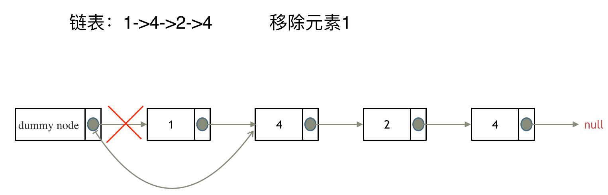

# 203. 移除链表元素

## 题目特征

- 移除链表元素
- 空间复杂度$O(1)$
- 时间复杂度$O(N)$

## 题目解法

让节点next指针直接指向下下一个节点就可以了

注意：

因为单链表的特殊性，只能指向下一个节点，那么如果删除的是头结点又该怎么办呢？

这里就涉及如下链表操作的两种方式：

- 直接使用原来的链表来进行删除操作。
- 设置一个虚拟头结点在进行删除操作。

第一种操作：直接使用原来的链表来进行移除

只要将头结点向后移动一位就可以，这样就从链表中移除了一个头结点。

第二种操作：设置一个虚拟头结点

这样原链表的所有节点就都可以按照统一的方式进行移除了。

最后呢在题目中，return 头结点的时候，别忘了 `return dummyNode->next`;， 这才是新的头结点